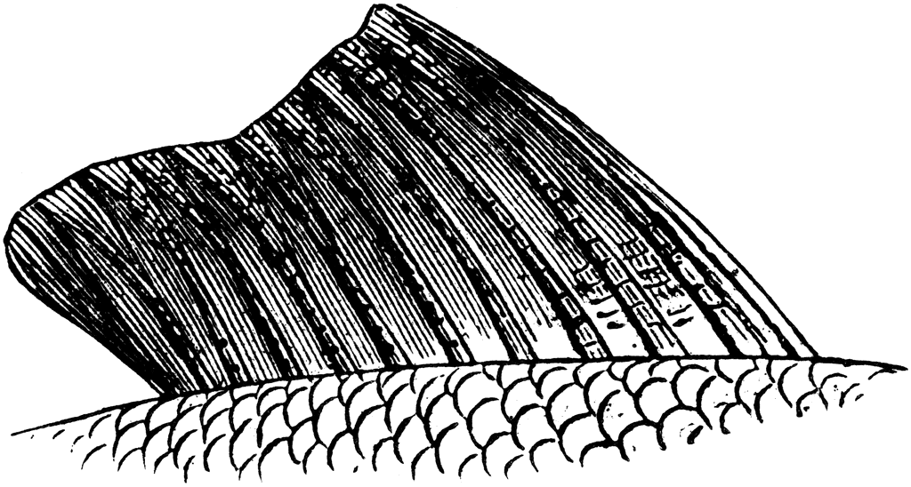

<div class="row">
  <div class="column"></div>
  <div class="column"><h1> Feature-Imitating-Networks (FINS) </h1></div>
</div>

Code for the paper ["Feature Imitating Networks"](https://github.com/sari-saba-sadiya/Feature-Imitating-Networks/blob/main/FINS_ICASSP22_arXiv.pdf) by Sari Saba-Sadiya, Tuka Alhanai, and Mohammad M Ghassemi. FINs for going deep (learning). 

<br>

## Overview:
A FIN is a neural network with weights that are initialized to reliably approximate one or more closed-form statistical features, such as Shannon’s entropy. This work demonstrates that FINs (and FIN ensembles) can provide best-in-class performance for a variety of downstream signal processing and inference tasks, while using less data and requiring less fine-tuning compared to other networks of similar (or even greater) representational power.

<br>

## Youtube Demo
The recorded presentation contains a theoretical part and a demo that starts at 6:25s.
[](https://youtu.be/TY_-wGrt3lM?t=387)


<br>

## Cite
```
@INPROCEEDINGS{FIN_ICASSP22,
  author={Saba-Sadiya, Sari and Alhanai, Tuka and Ghassemi, Mohammad M},
  booktitle={ICASSP 2022 - 2022 IEEE International Conference on Acoustics, Speech and Signal Processing (ICASSP)}, 
  title={Feature Imitating Networks}, 
  year={2022},
  volume={},
  number={},
  pages={4128-4132},
  doi={10.1109/ICASSP43922.2022.9746397}
}

```
